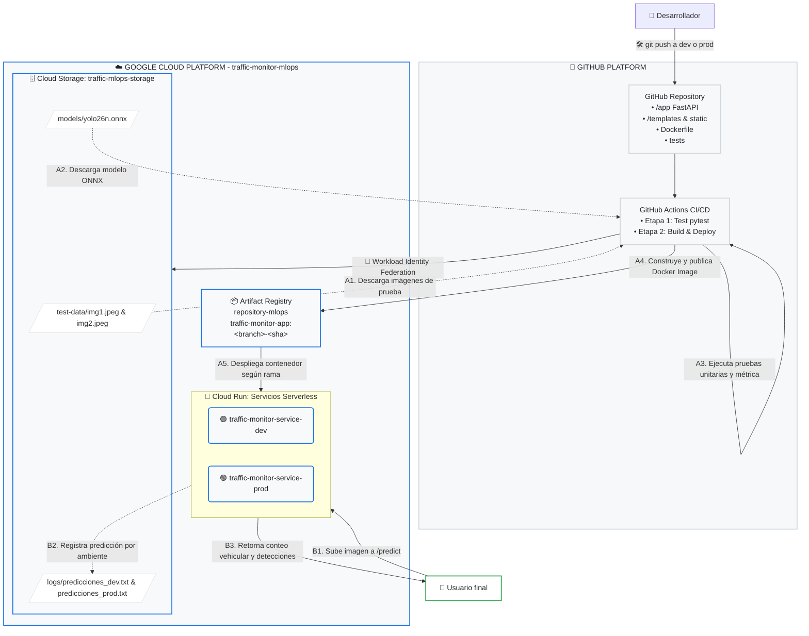

# Traffic Monitor AI — Despliegue automático de modelo ONNX con CI/CD


## 1. Descripción general

**Traffic Monitor AI** es una aplicación de inteligencia artificial para el monitoreo vehicular en imágenes.  
El sistema utiliza un modelo **YOLO26 en formato ONNX** para detectar y contar vehículos, y expone el modelo mediante una aplicación web y una API desarrollada con **FastAPI**.

El proyecto implementa un sistema de **despliegue automático con GitHub Actions**, Docker y Google Cloud Run, permitiendo que cada cambio enviado a las ramas `dev` o `prod` ejecute pruebas automáticas, construya una imagen Docker y actualice el endpoint correspondiente.

Este repositorio fue desarrollado como solución para el componente de **Sistemas de despliegue automático** del curso, considerando un escenario donde ya existe un modelo en producción y se requiere automatizar la promoción de nuevos modelos o nuevas versiones de la aplicación.

---

## 2. Objetivo del proyecto

Proponer e implementar un sistema MLOps básico que permita:

- Descargar un modelo ONNX desde almacenamiento externo.
- Descargar datos de prueba desde un bucket.
- Ejecutar pruebas unitarias sobre el modelo antes del despliegue.
- Validar que el modelo responde correctamente ante entradas definidas.
- Validar que una métrica de conteo no tenga una desviación significativa.
- Construir un contenedor Docker con la aplicación de inferencia.
- Desplegar automáticamente la aplicación en Google Cloud Run.
- Separar los ambientes `dev` y `prod` mediante ramas y endpoints independientes.
- Registrar cada predicción realizada en archivos TXT separados por ambiente.

---

## 3. Arquitectura general de la solución

La solución se diseñó bajo una arquitectura MLOps sencilla, reproducible y separada por ambientes. La decisión principal fue utilizar **GitHub Actions** como motor de CI/CD, **Cloud Storage** como repositorio externo para artefactos del modelo, datos de prueba y logs, **Artifact Registry** como registro de imágenes Docker y **Cloud Run** como plataforma serverless para exponer los endpoints de inferencia.

Esta decisión permite cumplir con los requisitos del curso, ya que el modelo `.onnx` y las imágenes de prueba no viven dentro del repositorio, sino que son descargados automáticamente desde el bucket durante el pipeline. Además, cada rama (`dev` y `prod`) actualiza un servicio independiente en Cloud Run, permitiendo separar validación, despliegue y monitoreo por ambiente.



### 3.1 Flujo de CI/CD

El flujo de CI/CD inicia cuando el desarrollador realiza un `git push` a la rama `dev` o `prod`. GitHub Actions autentica de forma segura contra Google Cloud mediante **Workload Identity Federation**, descarga las imágenes de prueba y el modelo ONNX desde Cloud Storage, ejecuta las pruebas unitarias con `pytest` y, si todo es correcto, construye una imagen Docker. Posteriormente, la imagen se publica en Artifact Registry y se despliega automáticamente en el servicio Cloud Run correspondiente a la rama.

### 3.2 Flujo de inferencia en tiempo de ejecución

Cuando un usuario final consume el endpoint `/predict`, la aplicación desplegada en Cloud Run recibe una imagen, ejecuta la inferencia con el modelo ONNX y retorna el conteo vehicular junto con las detecciones encontradas. Cada solicitud también genera un registro en formato TXT dentro de Cloud Storage, separando las predicciones de desarrollo y producción en `predicciones_dev.txt` y `predicciones_prod.txt`.

### 3.3 Decisión arquitectónica

Se seleccionó esta arquitectura porque permite una separación clara entre código fuente, artefactos de modelo, datos de prueba, contenedores y servicios de inferencia. Además, Cloud Run reduce la complejidad operativa porque no requiere administrar servidores, Artifact Registry centraliza las imágenes Docker versionadas y Cloud Storage permite mantener fuera del repositorio los archivos pesados o cambiantes, como el modelo `.onnx`, las imágenes de prueba y los logs de predicción.

---

## 4. Tecnologías utilizadas

| Componente                | Tecnología                 |
| ------------------------- | -------------------------- |
| Lenguaje principal        | Python 3.10                |
| Framework de API          | FastAPI                    |
| Interfaz web              | HTML, CSS, Jinja2          |
| Formato del modelo        | ONNX                       |
| Motor de inferencia       | ONNX Runtime               |
| Procesamiento de imágenes | OpenCV                     |
| Pruebas                   | Pytest                     |
| Contenerización           | Docker                     |
| CI/CD                     | GitHub Actions             |
| Registro de imágenes      | Google Artifact Registry   |
| Despliegue                | Google Cloud Run           |
| Almacenamiento externo    | Google Cloud Storage       |
| Registro de predicciones  | Archivos TXT en bucket GCS |

---

## 5. Estructura del repositorio

```text
traffic_monitor_ai/
│
├── .github/
│   └── workflows/
│       └── cicd.yml                 # Pipeline CI/CD para dev y prod
│
├── app/
│   ├── main.py                      # Aplicación FastAPI y endpoints
│   ├── model.py                     # Carga ONNX, inferencia y postprocesamiento
│   ├── config.py                    # Variables de configuración
│   ├── model_manager.py             # Descarga y verificación del modelo
│   ├── storage.py                   # Registro de predicciones en TXT/GCS
│   ├── ui.py                        # Render de interfaz administrativa
│   └── visualization.py             # Dibujo de cajas sobre imágenes
│
├── scripts/
│   └── download_model.py            # Script para descargar el modelo ONNX
│
├── static/                          # Archivos estáticos de la interfaz
├── templates/                       # Plantillas HTML
│
├── tests/
│   └── test_model.py                # Pruebas unitarias del modelo
│
├── Dockerfile                       # Construcción del contenedor
├── requirements.txt                 # Dependencias Python
├── INSTRUCCIONES_DE_USO.md          # Guía complementaria
└── README.md                        # Documentación principal del proyecto
```

---

## 6. Ramas y ambientes

El repositorio trabaja con dos ramas principales:

| Rama   | Ambiente   | Servicio Cloud Run             | Archivo de predicciones      |
| ------ | ---------- | ------------------------------ | ---------------------------- |
| `dev`  | Desarrollo | `traffic-monitor-service-dev`  | `logs/predicciones_dev.txt`  |
| `prod` | Producción | `traffic-monitor-service-prod` | `logs/predicciones_prod.txt` |

Cada vez que se realiza un `push` a cualquiera de estas ramas, se ejecuta automáticamente el pipeline de CI/CD.

---

## 7. Modelo ONNX

El modelo utilizado es **YOLO26 en formato ONNX**, empleado para detección de objetos y conteo vehicular.

El archivo `.onnx` **no debe almacenarse en el repositorio**, cumpliendo con el requerimiento del curso.  
En su lugar, el modelo se descarga desde una ubicación externa, por ejemplo:

```text
gs://<GCP_BUCKET_NAME>/models/yolo26n.onnx
```

También se puede usar una referencia externa mediante la variable:

```text
MODEL_URL=https://huggingface.co/zwh20081/yolo26-onnx/resolve/main/yolo26n.onnx
```

La ruta local dentro del contenedor se define con:

```text
MODEL_PATH=/app/yolo26n.onnx
```

---

## 8. Clases vehiculares configuradas

El modelo trabaja con clases del conjunto COCO.  
Por defecto, el sistema cuenta únicamente carros:

```text
VEHICLE_CLASS_IDS=2
```

Donde:

|  ID | Clase      |
| --: | ---------- |
|   2 | car        |
|   3 | motorcycle |
|   5 | bus        |
|   7 | truck      |

Para monitoreo vehicular más amplio se puede configurar:

```text
VEHICLE_CLASS_IDS=2,3,5,7
```

---

## 9. Pipeline de CI/CD

El archivo `.github/workflows/cicd.yml` define el pipeline automático con GitHub Actions.

### 9.1 Evento disparador

El pipeline se ejecuta con cada `push` a las ramas:

```yaml
on:
  push:
    branches:
      - dev
      - prod
```

Esto permite que los cambios en desarrollo y producción tengan validación y despliegue automático.

---

## 10. Etapa 1: Test

La etapa `test` valida el modelo antes del despliegue.

### Acciones principales

1. Clona el repositorio.
2. Configura Python 3.10.
3. Instala las dependencias desde `requirements.txt`.
4. Autentica con Google Cloud mediante Workload Identity Federation.
5. Descarga imágenes de prueba desde Cloud Storage.
6. Descarga el modelo ONNX desde Cloud Storage.
7. Ejecuta las pruebas unitarias con `pytest`.

### Datos de prueba

Los datos de prueba no están almacenados en el repositorio.  
Se descargan desde el bucket configurado en Google Cloud Storage:

```bash
gcloud storage cp gs://${{ secrets.GCP_BUCKET_NAME }}/test-data/img1.jpeg ./tests/data/img1.jpeg
gcloud storage cp gs://${{ secrets.GCP_BUCKET_NAME }}/test-data/img2.jpeg ./tests/data/img2.jpeg
```

### Modelo de prueba

El modelo ONNX también se descarga desde el bucket:

```bash
gcloud storage cp gs://${{ secrets.GCP_BUCKET_NAME }}/models/yolo26n.onnx ./yolo26n.onnx
```

### Pruebas implementadas

El archivo `tests/test_model.py` incluye pruebas como:

| Prueba                                         | Propósito                                                                               |
| ---------------------------------------------- | --------------------------------------------------------------------------------------- |
| `test_model_responds_with_defined_input`       | Verifica que el modelo responda ante una imagen definida. **Requerimiento (Prueba 1): "Probar que el modelo responde con datos de entrada definidos"                              |
| `test_model_returns_expected_output_structure` | Valida que la salida tenga estructura esperada: `count`, `detections` y `class_counts`. |
| `test_count_metric_has_no_significant_change`  | Comprueba que el conteo no se aleje significativamente de un valor esperado. **Requerimiento (Prueba 2): "Probar que no existe un cambio significativo en alguna métrica definida... usando algún valor límite"            |
| `test_model_detections_have_coordinates`       | Verifica que las detecciones tengan coordenadas válidas.                                |

La prueba de métrica usa las siguientes variables:

```text
EXPECTED_COUNT=20
MAX_ABS_ERROR=2
```

Esto significa que el pipeline falla si el conteo del modelo se aleja más de 2 unidades frente al valor esperado.

---

## 11. Etapa 2: Build / Promote

La etapa `build-and-deploy` solo se ejecuta si la etapa `test` finaliza correctamente.

### Acciones principales

1. Clona el repositorio.
2. Autentica con Google Cloud.
3. Configura Docker para Artifact Registry.
4. Descarga el modelo ONNX desde el bucket.
5. Construye la imagen Docker.
6. Sube la imagen a Artifact Registry.
7. Actualiza el servicio correspondiente en Cloud Run.

### Construcción de la imagen

```bash
docker build \
  -t us-central1-docker.pkg.dev/traffic-monitor-mlops/repository-mlops/traffic-monitor-app:${GITHUB_SHA} .
```

### Publicación de la imagen

```bash
docker push \
  us-central1-docker.pkg.dev/traffic-monitor-mlops/repository-mlops/traffic-monitor-app:${GITHUB_SHA}
```

### Despliegue automático

El nombre del servicio se construye dinámicamente según la rama:

```bash
gcloud run deploy traffic-monitor-service-${{ github.ref_name }}
```

Por tanto:

- Un push a `dev` actualiza `traffic-monitor-service-dev`.
- Un push a `prod` actualiza `traffic-monitor-service-prod`.

---

## 12. Dockerfile

El proyecto contiene un `Dockerfile` que:

1. Usa `python:3.10-slim` como imagen base.
2. Instala dependencias nativas necesarias para OpenCV.
3. Instala las dependencias Python.
4. Copia el proyecto al contenedor.
5. Copia el modelo `yolo26n.onnx` previamente descargado en la etapa de build.
6. Expone el puerto `8080`.
7. Ejecuta la aplicación con Uvicorn.

Comando principal del contenedor:

```bash
uvicorn app.main:app --host 0.0.0.0 --port ${PORT}
```

---

## 13. Endpoints principales

| Endpoint                | Método | Descripción                                                     |
| ----------------------- | -----: | --------------------------------------------------------------- |
| `/`                     |    GET | Interfaz web para cargar imágenes y visualizar resultados.      |
| `/ui/predict`           |   POST | Endpoint usado por la interfaz web.                             |
| `/predict`              |   POST | Endpoint API para realizar predicciones.                        |
| `/docs`                 |    GET | Documentación Swagger generada por FastAPI.                     |
| `/health`               |    GET | Estado básico del servicio.                                     |
| `/model-status`         |    GET | Estado del modelo ONNX cargado.                                 |
| `/admin/model`          |    GET | Interfaz para verificar el modelo.                              |
| `/admin/download-model` |   POST | Descarga o actualiza el modelo desde la referencia configurada. |
| `/download-history`     |    GET | Descarga el historial TXT de predicciones del ambiente actual.  |

---

## 14. Ejemplo de consumo del endpoint de predicción

```bash
curl -X POST "https://<CLOUD_RUN_URL>/predict" \
  -H "accept: application/json" \
  -H "Content-Type: multipart/form-data" \
  -F "file=@tests/data/img1.jpeg"
```

Ejemplo de respuesta:

```json
{
  "request_id": "8ec8f77f-8c8a-4f67-96c4-4a7f35e84a52",
  "timestamp_utc": "2026-06-08T00:00:00Z",
  "environment": "DEV",
  "model_path": "/app/yolo26n.onnx",
  "vehicle_class_ids": [2],
  "vehicle_class_labels": ["car"],
  "confidence_threshold": 0.25,
  "count": 20,
  "class_counts": {
    "car": 20
  },
  "detections": []
}
```

---

## 15. Registro de predicciones para monitoreo

Cada llamada a `/predict` o `/ui/predict` registra una nueva línea en un archivo TXT.

Los archivos se guardan separados por ambiente:

```text
logs/predicciones_dev.txt
logs/predicciones_prod.txt
```

Cada línea contiene una predicción en formato JSON, lo que permite futuros procesos de monitoreo, auditoría o análisis de deriva del modelo.

Ejemplo de línea registrada:

```json
{"timestamp_utc": "2026-06-05T04:49:27.694948+00:00", "entorno": "PROD", "request_id": "5567e7e3-bb66-4aed-90c1-5840e7f838cb", "environment": "dev", "count": 18, "class_counts": {"car": 18}, "confidence_threshold": 0.25}
```

---

## 16. Variables de entorno

| Variable             | Descripción                                 | Ejemplo                                   |
| -------------------- | ------------------------------------------- | ----------------------------------------- |
| `MODEL_URL`          | URL externa del modelo ONNX.                | `https://huggingface.co/.../yolo26n.onnx` |
| `MODEL_PATH`         | Ruta local del modelo.                      | `/app/yolo26n.onnx`                       |
| `ENV_STAGE`          | Ambiente desplegado según la rama.          | `dev` o `prod`                            |
| `ENVIRONMENT`        | Ambiente lógico de ejecución.               | `dev`                                     |
| `CONF_THRESHOLD`     | Umbral mínimo de confianza.                 | `0.25`                                    |
| `IOU_THRESHOLD`      | Umbral IoU para NMS.                        | `0.45`                                    |
| `VEHICLE_CLASS_IDS`  | Clases COCO a contar.                       | `2,3,5,7`                                 |
| `GCP_BUCKET_NAME`    | Bucket donde están el modelo, datos y logs. | `traffic-mlops-storage`                   |
| `PREDICTIONS_BUCKET` | Bucket opcional para predicciones.          | `traffic-mlops-storage`                   |
| `PREDICTIONS_BLOB`   | Archivo TXT de predicciones.                | `predicciones_dev.txt`                    |

---

## 17. Secrets requeridos en GitHub Actions

Para ejecutar el pipeline se deben configurar los siguientes secretos en GitHub:

| Secret                           | Descripción                                                                       |
| -------------------------------- | --------------------------------------------------------------------------------- |
| `GCP_WORKLOAD_IDENTITY_PROVIDER` | Proveedor de Workload Identity Federation para autenticar GitHub Actions con GCP. |
| `GCP_SERVICE_ACCOUNT`            | Cuenta de servicio usada por GitHub Actions.                                      |
| `GCP_BUCKET_NAME`                | Nombre del bucket donde se almacenan modelo, datos de prueba y logs.              |

---

## 18. Ejecución local

### 18.1 Crear entorno virtual

```bash
python -m venv .venv
source .venv/bin/activate
```

En Windows PowerShell:

```powershell
py -m venv .venv
.\.venv\Scripts\Activate.ps1
```

### 18.2 Instalar dependencias

```bash
pip install --upgrade pip
pip install -r requirements.txt
```

### 18.3 Descargar modelo

```bash
python scripts/download_model.py
```

También se puede descargar desde la interfaz administrativa:

```text
http://127.0.0.1:8000/admin/model
```

### 18.4 Ejecutar la aplicación

```bash
uvicorn app.main:app --reload --host 0.0.0.0 --port 8000
```

Abrir en el navegador:

```text
http://127.0.0.1:8000
```

---

## 19. Ejecución con Docker

Construir la imagen:

```bash
docker build -t traffic-monitor-ai .
```

Ejecutar el contenedor:

```bash
docker run -p 8080:8080 \
  -e ENV_STAGE=dev \
  -e MODEL_PATH=/app/yolo26n.onnx \
  -e CONF_THRESHOLD=0.25 \
  -e IOU_THRESHOLD=0.45 \
  -e VEHICLE_CLASS_IDS=2 \
  -e GCP_BUCKET_NAME=traffic-mlops-storage \
  traffic-monitor-ai
```

Abrir:

```text
http://127.0.0.1:8080
```

---

## 20. Ejecución de pruebas localmente

Para ejecutar las pruebas:

```bash
pytest -v
```

Con variables de entorno:

```bash
TEST_IMAGE_PATH=tests/data/img1.jpeg \
MODEL_PATH=./yolo26n.onnx \
EXPECTED_COUNT=20 \
MAX_ABS_ERROR=2 \
pytest -v
```

---

## 21. Criterios de cumplimiento de la rúbrica

| Requerimiento                         | Cumplimiento en el proyecto                                                         |
| ------------------------------------- | ----------------------------------------------------------------------------------- |
| Repositorio en GitHub                 | El proyecto está versionado en GitHub.                                              |
| Pipeline CI/CD con GitHub Actions     | Implementado en `.github/workflows/cicd.yml`.                                       |
| Dos ramas: `dev` y `prod`             | El pipeline se ejecuta para ambas ramas.                                            |
| Endpoint por rama                     | Cloud Run despliega `traffic-monitor-service-dev` y `traffic-monitor-service-prod`. |
| Etapa `test`                          | Descarga datos y modelo desde GCS, luego ejecuta `pytest`.                          |
| Etapa `build/promote`                 | Construye imagen Docker, la sube a Artifact Registry y actualiza Cloud Run.         |
| Modelo ONNX fuera del repositorio     | Se descarga desde bucket o referencia externa.                                      |
| Datos de prueba fuera del repositorio | Se descargan desde `gs://<bucket>/test-data/`.                                      |
| Prueba de respuesta del modelo        | Implementada en `test_model_responds_with_defined_input`.                           |
| Prueba de métrica                     | Implementada en `test_count_metric_has_no_significant_change`.                      |
| Contenedor Docker                     | Definido mediante `Dockerfile`.                                                     |
| Aplicación para usuario final         | FastAPI con interfaz web y endpoint `/predict`.                                     |
| Despliegue automático con push        | Configurado para `dev` y `prod`.                                                    |
| Registro TXT por ambiente             | `predicciones_dev.txt` y `predicciones_prod.txt`.                                   |

---

## 22. Flujo recomendado de trabajo

### Desarrollo

```bash
git checkout dev
git add .
git commit -m "feat: actualizar inferencia del modelo ONNX"
git push origin dev
```

Esto ejecuta el pipeline y actualiza el endpoint de desarrollo.

### Promoción a producción

```bash
git checkout prod
git merge dev
git push origin prod
```

Esto ejecuta nuevamente pruebas, construye la imagen y actualiza el endpoint de producción.

---

## 23. Buenas prácticas aplicadas

- Separación de ambientes mediante ramas.
- Modelo ONNX excluido del repositorio.
- Datos de prueba externos al repositorio.
- Validación automática antes del despliegue.
- Contenerización de la aplicación.
- Despliegue reproducible en Cloud Run.
- Registro de predicciones para monitoreo.
- Uso de variables de entorno y secretos.
- Autenticación segura mediante Workload Identity Federation.

---

## 24. Limitaciones actuales

- Las pruebas dependen de imágenes de referencia alojadas en el bucket.
- La métrica actual se basa en diferencia absoluta de conteo; en escenarios más avanzados se podrían incluir métricas como precisión, recall o mAP.
- El registro de predicciones se realiza en archivos TXT; para monitoreo productivo podría migrarse a BigQuery, Cloud Logging o una base de datos analítica.
- El modelo se ejecuta en CPU mediante ONNX Runtime; para cargas mayores podría evaluarse GPU o servicios especializados.

---

## 25. Mejoras futuras

- Agregar validación de drift de datos.
- Registrar latencia por predicción.
- Agregar versionamiento explícito del modelo.
- Implementar canary deployment o blue/green deployment.
- Guardar métricas de inferencia en BigQuery.
- Agregar monitoreo con dashboards.
- Agregar pruebas de carga al endpoint.
- Incluir validación de seguridad del contenedor.
- Automatizar promoción de `dev` a `prod` mediante pull request aprobado.

---

## 26. Conclusión

Este proyecto implementa una solución completa de despliegue automático para un modelo ONNX de monitoreo vehicular.  
La arquitectura integra GitHub Actions, pruebas unitarias, descarga externa del modelo y datos de prueba, Docker, Artifact Registry, Google Cloud Run y registro de predicciones por ambiente.

Con esta solución, cada cambio enviado a `dev` o `prod` puede ser validado, empaquetado y desplegado automáticamente, permitiendo que los usuarios finales consuman el modelo actualizado desde endpoints independientes para desarrollo y producción.
